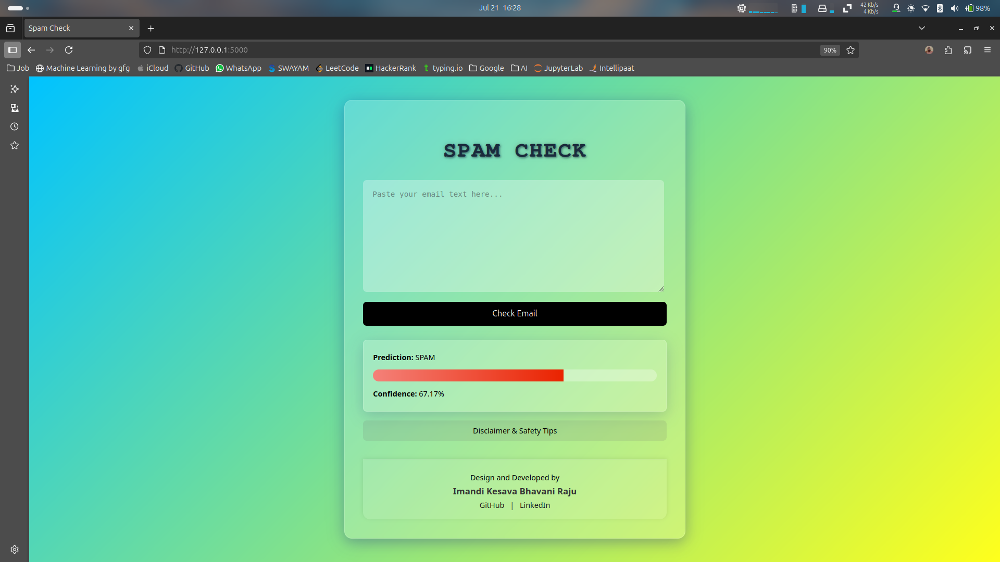

# Spam Email Detection Web App

This is a simple **Spam Email Classifier** web application built with:
- **Python (Flask)** as the backend server
- **Scikit-learn** for ML model
- **MySQL** for saving predictions
- **HTML, CSS, JS** with a clean, glassmorphic UI

---


## Features

- Paste your email text and check if it’s **SPAM** or **HAM**
- Displays prediction confidence with a progress bar
- Saves each input and prediction to your MySQL database for model improvement
- Shows a **consent popup** only once per session to inform users about data storage
- Simple disclaimer page for safety & privacy tips

---

## Project Structure

```
Email-Spam-Detection/
│
├── data/                  # Raw Email data
│   ├── ham/
│   └── spam/
│
├── database/              # DataBase Query's
│   └── schema.sql
│
├── models/                # Trained ML models & backups
│   ├── spam_model.pkl
│   ├── vectorizer.pkl
│   └── backup/            # Backup of my before model pickle files
|         ├── spam_model.pkl
│         └── vectorizer.pkl
│
├── notebooks/             # Jupyter notebooks (analysis, EDA)
│   └── spam_detection.ipynb
│
├── static/                # Static files: Contain style.css file
│   └── style.css
│
├── templates/             # HTML templates
│   ├── index.html
│   └── disclaimer.html
│
├── app.py                 # Flask entrypoint
├── requirements.txt       # Python dependencies
└── README.md              # Project documentation

```

---

## How to Run

**1. Install dependencies**
```bash
pip install -r requirements.txt
```

**2. Set up MySQL**

- Create database:  
  ```sql
  CREATE DATABASE spam_checker;
  ```
- Create table:  
  ```sql
  USE spam_checker;

  CREATE TABLE predictions (
      id INT AUTO_INCREMENT PRIMARY KEY,
      email_body TEXT,
      label VARCHAR(10),
      confidence FLOAT
  );
  ```

- Update your DB credentials in `app.py`:
  ```python
  db = mysql.connector.connect(
      host="localhost",
      user="YOUR_USERNAME",
      password="YOUR_PASSWORD",
      database="spam_checker"
  )
  ```

**3. Run Flask app**
```bash
python app.py
```

**4 Open your browser and visit:** 
```bash 
  http://localhost:5000
  ```

---

## Designed & Developed

**Imandi Kesava Bhavani Raju**  
- [GitHub](https://github.com/kesavaimandi)  
- [LinkedIn](https://www.linkedin.com/in/imandi-kesava)
